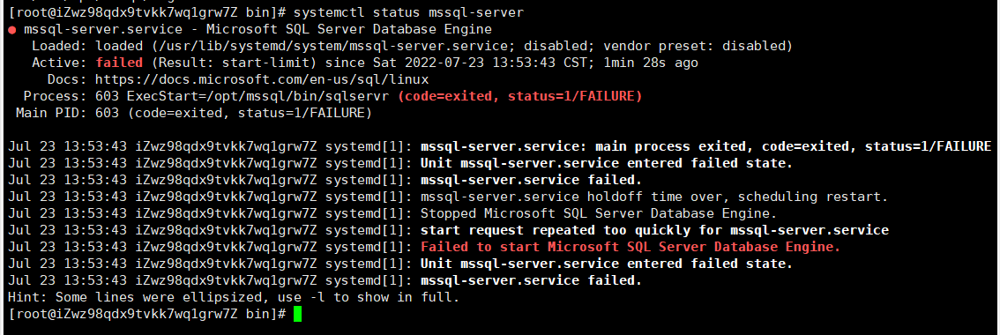

# 2022-07-23-服务器安装SqlServer

```
// 下载微软官方的 sqlserver 源到本地
curl -o /etc/yum.repos.d/mssql-server.repo https://packages.microsoft.com/config/rhel/7/mssql-server-2017.repo

// 安装
yum install -y mssql-server

// 启动安装程序
/opt/mssql/bin/mssql-conf setup

// 根据提示选择版本后输入 sa 用户的密码
//为防止挖矿病毒，请确保为 SA 帐户指定强密码（最少 8 个字符，包括大写和小写字母、十进制数字和/或非字母数字符号）。

// 查看是否启动成功
systemctl status mssql-server
```

如果遇到如下错误 👇



```
// 防火墙开放 sqlserver 的 1433 端口（如果没开防火墙就不用），服务器的 1433 端口也要开！！！
firewall-cmd --add-port=1433/tcp --permanent
firewall-cmd --reload

// 修改权限
cd /opt/mssql/bin/
chmod 777 sqlservr
```

## 安装sqlserver命令行工具 sqlcmd
```
//下载微软官方的软件包 yum 源
wget -O  /etc/yum.repos.d/msprod.repo https://packages.microsoft.com/config/rhel/7/prod.repo

// 如果以前装过mssql，则需要删除较旧的UnixODBC软件包
yum remove unixODBC-utf16 unixODBC-utf16-devel 

// 安装 mssql 工具包和 UnixODBC 开发人员软件包（这一步命令会出现两次询问：是否接受许可条款，都输入 yes，回车确定）
yum install -y mssql-tools unixODBC-devel 

// 添加PATH环境变量
echo "export PATH=$PATH:/opt/mssql-tools/bin" >> /etc/profile
source /etc/profile
source ~/.bashrc

// 使用sqlcmd命令连接本地的sqlserver，输入之前设置的SA密码
sqlcmd -S localhost -U SA -p
```

参考网站： https://cloud.tencent.com/developer/article/1848758