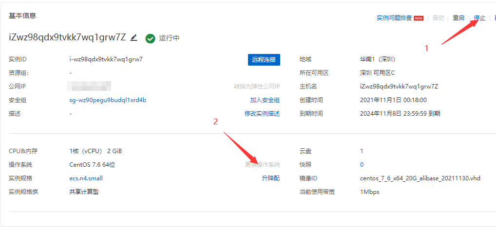
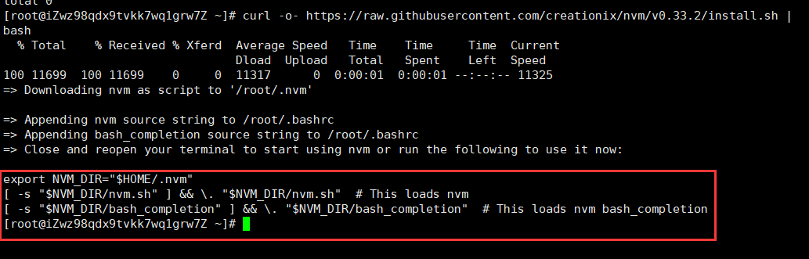

# 服务器玩坏后的操作

# 重置操作系统
先将实例停止运行，然后点击更换操作系统  


# 工具的安装和配置
## 安装 nvm
```
curl -o- https://raw.githubusercontent.com/creationix/nvm/v0.33.2/install.sh | bash
```
或
```
wget -qO- https://raw.githubusercontent.com/creationix/nvm/v0.33.2/install.sh | bash
```

按照提示在家目录下的 .bashrc 文件里输入以下代码  

```
export NVM_DIR="$HOME/.nvm"
[ -s "$NVM_DIR/nvm.sh" ] && \. "$NVM_DIR/nvm.sh"  # This loads nvm
[ -s "$NVM_DIR/bash_completion" ] && \. "$NVM_DIR/bash_completion"  # This loads nvm bash_completion
```
部分系统会自动配置(不清楚，我目前是 centos7.6, 有自动配置),以防万一还是输入 vi ~/.bashrc 查看  
输入 source ~/.bashrc 重新加载环境变量

## 安装 nodejs 环境
```
nvm install <需要的版本>
```
目前 LTS(长期支持版)为 16.14.2(具体可去官网自行查看)

## 安装 nginx
yum install -y nginx

## 安装 acme.sh
```
curl  https://get.acme.sh | sh
```
或
```
curl  https://get.acme.sh | sh -s email=my@example.com
```

## 安装 yarn
```
npm install -g yarn
```

## 安装 pm2
```
npm install -g pm2
```

## 安装 postgresql
```
yum install -y https://download.postgresql.org/pub/repos/yum/reporpms/EL-7-x86_64/pgdg-redhat-repo-latest.noarch.rpm

yum install -y postgresql14-server

/usr/pgsql-14/bin/postgresql-14-setup initdb
```

## DNS 手动生成证书
```
acme.sh --issue --dns -d pigfarm.top --yes-I-know-dns-manual-mode-enough-go-ahead-please
```

生成后复制到对应文件夹内即可